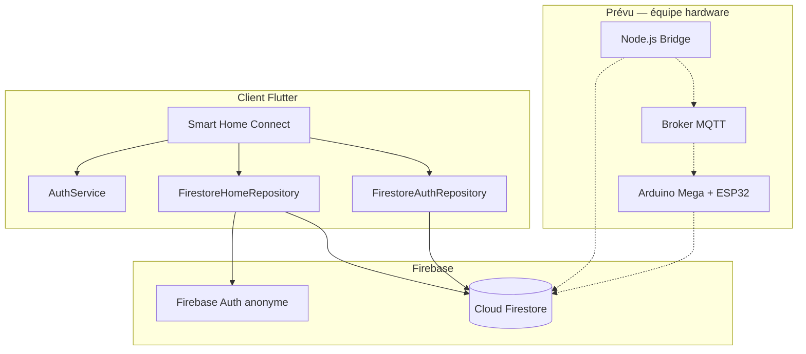

# Documentation technique — Smart Home Connect

## 1. Vue d’ensemble

**Smart Home Connect** est une application Flutter de domotique qui utilise **Firestore** comme source de vérité pour l’état des capteurs et actionneurs. L’application suit un schéma de données académique (diagramme UML) et prépare l’intégration d’un firmware Arduino qui lira/écrira les mêmes documents Firestore (directement ou via un bridge Node.js + MQTT).

### Objectifs

- Permettre à un **utilisateur** de consulter sa maison, commander les actionneurs et gérer ses pièces.
- Permettre à un **administrateur** de gérer les utilisateurs, les maisons et la configuration matérielle (broches GPIO, types d’appareils).
- Garantir un **format de données stable** pour l’équipe Arduino (`type`, `pin`, `valeur`, `unit`, `piece`).

---

## 2. Architecture



### Flux de communication actuel

1. **Au lancement** : `Firebase.initializeApp()` puis `FirebaseAuth.signInAnonymously()` pour obtenir un accès Firestore.
2. **Login utilisateur** : lecture de `users` (email/téléphone + bcrypt), session stockée en `SharedPreferences`.
3. **Données maison** : streams Firestore sur `preferences/settings` (pièces) et `appareils` filtrés par `userId`.
4. **Commande appareil** : `set(merge)` sur `appareils/{id}` avec mise à jour de `valeur`.

> L’app **n’utilise pas** de serveur PHP ni d’API REST custom en production. `rest_home_repository.dart` est un stub pour une évolution future.

---

## 3. Authentification

### Double couche

| Couche | Mécanisme | Rôle |
|--------|-----------|------|
| Firebase Auth | `signInAnonymously()` | Débloquer l’accès SDK Firestore |
| Auth applicative | Collection `users` | Identité réelle, rôles, mot de passe |

### Inscription (`FirestoreAuthRepository.register`)

- Champs obligatoires : nom, email, téléphone, mot de passe.
- Mot de passe haché avec **bcrypt** (`$2b$10$…`).
- Création atomique (batch) :
  - `users/{userId}`
  - `users/{userId}/preferences/settings` (pièces vides, thème, langue…)

### Connexion

- Email **ou** téléphone + mot de passe.
- Timeout réseau 20 s, messages d’erreur explicites.
- Après connexion : redirection immédiate (user ou admin), chargement Firestore en arrière-plan.

### Rôles

| `role` | Interface | Permissions |
|--------|-----------|-------------|
| `user` | `HomeShellScreen` | Voir/commander appareils, ajouter/renommer pièces |
| `admin` | `AdminShellScreen` | CRUD appareils, users, maisons, seed démo |

Champ : `users/{userId}.role` — valeurs `"admin"` | `"user"`.

### Maisons partagées

- **Propriétaire** : `userId` possède `appareils` et `preferences/settings.pieces`.
- **Membre** : `users/{memberId}.houseOwnerUserId` pointe vers le propriétaire.
- Liste des membres : `users/{owner}/preferences/settings.memberUserIds[]`.

---

## 4. Navigation

### Utilisateur connecté (`HomeShellScreen`)

| Onglet | Écran | Description |
|--------|-------|-------------|
| 0 | `DashboardScreen` | Appareils filtrés par pièce |
| 1 | `PiecesScreen` | Liste des pièces, ajout, renommage |
| 2 | `ProfileScreen` | Profil, thème, langue, déconnexion |
| 3 | `SettingsScreen` | Paramètres, lien vers cartes RFID |

### Administrateur (`AdminShellScreen`)

| Onglet | Écran | Description |
|--------|-------|-------------|
| 0 | `AdminHousesScreen` | Maisons (users avec pièces/appareils) |
| 1 | `AdminUsersScreen` | CRUD utilisateurs |
| 2 | `AdminProfileScreen` | Profil admin |

Depuis **Maisons** → détail maison → dashboard admin avec `setAdminTargetUser(userId)` pour cibler les streams Firestore.

---

## 5. Modèle de données — Pièces

Les pièces ne sont **pas** une collection racine. Elles sont stockées de deux façons complémentaires :

1. **Liste déclarative** : `users/{userId}/preferences/settings.pieces`
   ```json
   "pieces": [
     { "id": "salon", "name": "Salon" },
     { "id": "garage", "name": "Garage" }
   ]
   ```

2. **Référence sur appareils** : champ `piece` (libellé affiché, ex. `"Salon"`).

`watchRooms()` fusionne les deux sources pour l’affichage.

### Opérations

| Action | Méthode | Qui |
|--------|---------|-----|
| Ajouter pièce | `addRoom(name)` | Tout user connecté |
| Renommer pièce | `renameRoom(id, name)` | Tout user connecté |
| Supprimer pièce | `deleteRoom(id)` | Admin seulement |

---

## 6. Modèle de données — Appareils

Collection racine : **`appareils/{sensorId}`**

Chaque document représente un capteur ou un actionneur. Voir [FIRESTORE.md](FIRESTORE.md) pour les exemples JSON complets.

### Champs communs

| Champ | Type | Description |
|-------|------|-------------|
| `sensorId` / `actuatorId` | string | ID du document |
| `type` | string | Type MAJUSCULE (DHT, PIR, RFID…) |
| `categorie` | string | `capteur` ou `actionneur` |
| `pin` | number | Broche GPIO (2–53) |
| `valeur` | string/number | État ou mesure |
| `unit` | string | Unité sémantique |
| `piece` | string | Nom de la pièce |
| `label` | string | Libellé affiché |
| `userId` | string | Propriétaire de la maison |
| `rfid_cible` | string | (SERVO) ID du lecteur RFID écouté |
| `lastChanged` | timestamp | Dernière commande |
| `changedBy` | string | userId ayant commandé |

### Commande depuis l’app

```dart
sendDeviceCommand(deviceId, {'isOn': true});
// → Firestore merge : { valeur: "1", lastChanged, changedBy }
```

---

## 7. Cartes RFID

Sous-collection : `users/{userId}/rfidCards/{cardId}`

```json
{
  "cardId": "card_ABCD1234",
  "userId": "usr_jean",
  "uid": "ABCD1234",
  "label": "Badge Papa",
  "active": true,
  "createdAt": "<timestamp>"
}
```

- Gérées depuis **Paramètres → Cartes RFID**.
- Le **lecteur RFID** (`appareils`, type `RFID`) pousse l’UID scanné dans `valeur`.
- Le **SERVO** peut écouter un lecteur via `rfid_cible` (optionnel).

---

## 8. Services principaux

### `FirestoreHomeRepository`

- Singleton : `FirestoreHomeRepository.instance`
- Streams : `watchRooms()`, `watchDevices()`
- CRUD : pièces, appareils, broches, déplacement, DHT, seed démo
- Bootstrap : auth anonyme + abonnements Firestore

### `FirestoreAuthRepository`

- `register`, `login`
- Admin : `createUserByAdmin`, `updateUserByAdmin`, `deleteUserByAdmin`
- Maison : `assignUserToHouse`, `unassignUserFromHouse`

### `AuthService`

- Session `SharedPreferences` : userId, email, rôle, houseOwnerUserId
- `authNotifier` : bascule login ↔ shell dans `main.dart`

### `RfidCardsRepository`

- CRUD badges RFID pour le propriétaire de maison (ou membre via `houseOwnerUserId`)

---

## 9. Interface appareils (`DeviceCard`)

| Type | Affichage | Commande |
|------|-----------|----------|
| DHT | Température + humidité | Lecture seule |
| PIR | Mouvement détecté / aucun | Lecture seule |
| RFID | UID badge scanné | Lecture seule |
| ULTRA | Distance en cm | Lecture seule |
| RELAIS, LAMPE, MOTEUR, MAX | Switch ON/OFF | `isOn` |
| SERVO | Porte ouverte/fermée + `rfid_cible` | `isOn` |

---

## 10. Configuration Firebase

### Projet

- Fichier `.firebaserc` : ID projet Firebase
- `firebase.json` : règles Firestore
- `lib/firebase_options.dart` : généré par FlutterFire CLI

### Règles actuelles (`firestore.rules`)

Toutes les collections sont en **lecture/écriture ouvertes** (`if true`) — adapté au développement, **à durcir avant production**.

### Déploiement

```bash
firebase deploy --only firestore:rules
```

### Auth anonyme

Firebase Console → Authentication → Sign-in method → **Anonymous** : activé.

---

## 11. Intégration Arduino (handoff)

### Principe

L’Arduino (ou le bridge Node) doit :

1. **Écouter** `appareils` où `userId == <propriétaire>` (snapshot Firestore ou MQTT relayé).
2. **Parser** chaque doc : `type`, `pin`, `valeur`, `unit`.
3. **Publier** les mesures capteurs dans `valeur` (ex. DHT → `"24.5/60.2"`, ULTRA → `"45"`).
4. **Exécuter** les commandes actionneurs quand `valeur` passe à `"1"` / `"0"`.

### Broches spéciales

| Type | Règle |
|------|-------|
| ULTRA (HC-SR04) | `pin` = Trigger, Echo = `pin + 1` |
| MAX7219 | `pin` = broche CS |
| DHT | Un seul doc, `valeur` = `"temp/hum"` |

### Format CONFIG (suggestion firmware)

```
CONFIG:RFID:10:garage
CONFIG:SERVO:9:garage:rfid_entree
CONFIG:ULTRA:5:garage
CONFIG:DHT:2:salon2
```

---

## 12. Backend Node.js (`backend/node-bridge/`)

Orchestrateur prévu :

```
Flutter → Firestore ← Node Bridge → MQTT → ESP32 → Arduino
```

- Dépendances : `firebase-admin`, `mqtt`, `dotenv`
- Configuration : `.env` avec chemin service account Firebase
- **État** : squelette présent, schéma Firestore de l’app migré vers `appareils` (le bridge d’origine ciblait `maison/led_status` — à adapter)

---

## 13. Développement

### Conventions code

- Types appareils en **MAJUSCULES** strictes (`DHT`, `RFID`, `SERVO`…)
- Logique métier capteurs : `lib/models/appareil_spec.dart`
- Parsing Firestore → UI : `lib/models/device.dart`
- Couleurs / thème : `lib/theme/smart_home_colors.dart`

### Commandes utiles

```bash
flutter pub get
flutter run
flutter analyze
flutter test
flutter build apk
```

### Créer un admin

1. S’inscrire via l’app.
2. Console Firebase → Firestore → `users/{userId}`.
3. Ajouter `"role": "admin"`.
4. Se reconnecter.

### Données de démo

En tant qu’admin, sur le dashboard d’une maison : bouton **« Créer des données de démo »** → appelle `FirestoreHomeRepository.seedDemoHome()`.

---

## 14. Limitations connues

- Règles Firestore non sécurisées en production.
- `accessLogs` et `alerts` : schéma déclaré, pas d’UI.
- Mot de passe oublié : placeholder (reset par admin possible).
- Écrans orphelins non intégrés à la nav : plan 2D, LED realtime.
- Pas de PHP — stack 100 % Flutter + Firebase + Node (futur).

---

## 15. Références fichiers

| Fichier | Rôle |
|---------|------|
| `lib/main.dart` | Routage global |
| `lib/models/appareil_spec.dart` | Spec types + payloads Firestore |
| `lib/services/firestore_home_repository.dart` | Données maison |
| `lib/services/firestore_auth_repository.dart` | Auth + admin users |
| `lib/services/firestore_schema.dart` | Constantes schéma |
| `firestore.rules` | Règles sécurité |
| `test/appareil_spec_test.dart` | Tests schéma |
